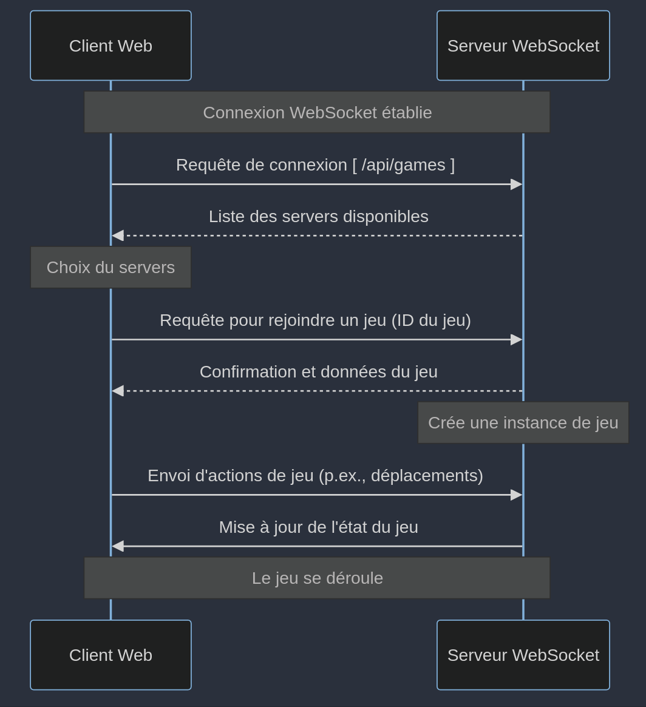

# README - Nom du Projet

Ce dépôt contient le code source pour notre jeu, développé dans le cadre de notre
SAE.

## Membres de l'équipe

- Grégoire Launay--Bécue
- Baptiste Collesson
- Kellian Mirey

## Diagrammes de Séquence

Les diagrammes de séquence suivants illustrent les interactions entre le client et le serveur via WebSocket.

[//]: # (```mermaid)

[//]: # (sequenceDiagram)

[//]: # (    participant Client as Client Web)

[//]: # (    participant Server as Serveur WebSocket)

[//]: # (    Note over Client,Server: Connexion WebSocket établie)

[//]: # ()

[//]: # (    Client->>Server: Requête de connexion [ /api/games ])

[//]: # (    Server-->>Client: Liste des servers disponibles)

[//]: # (    Note over Client: Choix du servers)

[//]: # ()

[//]: # (    Client->>Server: Requête pour rejoindre un jeu &#40;ID du jeu&#41;)

[//]: # (    Server-->>Client: Confirmation et données du jeu)

[//]: # (    Note over Server: Crée une instance de jeu)

[//]: # ()

[//]: # (    Client->>Server: Envoi d'actions de jeu &#40;p.ex., déplacements&#41;)

[//]: # (    Server->>Client: Mise à jour de l'état du jeu)

[//]: # (    Note over Client,Server: Le jeu se déroule)

[//]: # (```)



## Difficultés Techniques et Solutions

Au cours du développement, nous avons rencontré plusieurs défis majeurs :

### Charge de Travail Ambitieuse

Problème : Nous avons initialement sous-estimé la complexité du projet en planifiant une version par semaine. Cette
cadence s'est révélée irréaliste.

Solution : Réajustement des objectifs en cours de projet pour se concentrer sur les fonctionnalités clés et assurer une
progression stable.

### Manque de Fonctionnalités Critiques

Problème : Quelques heures avant le rendu final, nous avons découvert que des parties essentielles du code étaient
manquantes.

Solution : Grégoire a effectué une réécriture rapide du jeu pour inclure les fonctionnalités manquantes et répondre aux
exigences du sujet.

### Problèmes de Motivation

Problème : La charge de travail et les difficultés techniques ont entraîné une baisse de motivation au sein de l'équipe.

Solution : Communication ouverte et soutien mutuel pour surmonter les obstacles et maintenir l'engagement envers le
projet.

## Points d'Amélioration

- Planification et Gestion du Temps : Mieux évaluer la portée du projet dès le début pour éviter les surcharges de
  travail imprévues.
- Tests Continus : Intégrer des tests plus réguliers pour identifier et résoudre les problèmes plus tôt dans le cycle de
  développement.

## Accomplissements

### Nous sommes particulièrement fiers de :

- Fonctionnalités Complètes : Malgré un début difficile, la majorité des fonctionnalités est désormais disponible et
  fonctionnelle.
- Réactivité aux Imprévus : La capacité de l'équipe à s'adapter rapidement aux exigences changeantes et aux découvertes
  de dernière minute.

### Fonctionnalités et API

- Crédits : Une page simple créditant les créateurs avec leur jeu préféré.
- Scores : Les scores sont stockés dans /data/scores.json et récupérés via une requête API à /api/scores.
- Serveurs : La liste des serveurs disponibles est récupérée par une requête API à /api/games. Elle inclut le temps
  depuis la création du jeu, le nombre de joueurs, le nom du jeu, et un bouton pour se connecter.
- Création de Jeu : Permet de créer une partie en choisissant la difficulté, le nombre de joueurs, et le nom du jeu. Une
  fois le bouton créer pressé, une requête de création est faite et retourne le jeu, ce qui ouvre la session.
- Compte Utilisateur : Permet de modifier sa couleur et son pseudo. Ces données sont sauvegardées dans le
  sessionStorage.
- Gameplay : Une fois la partie créée, il est possible de se connecter via /games/<uuidv4>. Le pseudo et la couleur sont
  alors envoyés au serveur pour la création d'une entité joueur, et le client se connecte automatiquement au WebSocket
  de la partie.

## Conclusion

En conclusion, ce projet nous a permis de développer nos compétences en développement de jeux, gestion de projet, et
programmation réseau. Nous avons appris à mieux anticiper les défis techniques et à collaborer efficacement sous
pression. Nous envisageons d'utiliser ces compétences acquises pour améliorer nos futurs projets de développement de
jeux.